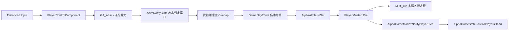

# Alpha
<div align="center">

<br>


</div>

> 基于 **Unreal Engine 5.8 + C++** 开发的第三人称动作游戏 Demo。
> 移动动画由 **Motion Matching（Pose Search）** 驱动，战斗与属性系统基于 **GAS（Gameplay Ability System）** 实现。
>
> 仓库用于展示 **C++ 实现**，入库内容为 `Source/`、`Config/`、`Alpha.uproject` 及工程配置
> （`.editorconfig` / `.vsconfig` / `.gitattributes`）与 `Plugins/VisualStudioTools`；
> `Content/` 下的美术 / 蓝图 / 动画资产整体不入库（详见「快速开始」）。

---

## 技术栈

| 类别 | 使用 |
|---|---|
| 引擎 | Unreal Engine 5.8 |
| 语言 | C++（输入 / UI 表现层配合 Enhanced Input、UMG 蓝图） |
| 动画 | Motion Matching（Pose Search）+ Chooser |
| 能力系统 | Gameplay Ability System（GAS） |
| AI | Behavior Tree · Blackboard · AIPerception · Navigation |
| 网络 | Actor / 属性 / GameState 复制 + 服务器权威判定（GAS） |
| 版本管理 | Git + Git LFS（LFS 规则覆盖资产与媒体类型） |

---

## 快速导航

| 想看什么 | 去哪 |
|---|---|
| 项目定位与技术栈 | [技术栈](#技术栈) |
| 实现了哪些功能 | [核心特性](#核心特性) |
| **值得看的代码与设计取舍** | [代码亮点](#代码亮点) · [文档详情](docs/CODE_HIGHLIGHTS.md) |
| **开发中定位过的坑与根因** | [踩坑记录文档](docs/DEV_NOTES.md)（21 条，含引擎源码依据） |
| 系统间调用关系 | [架构速览](#架构速览) |
| 目录与文件划分 | [项目结构](#项目结构) |
| 引擎与插件依赖 | [环境要求](#环境要求)（阅读 / 编译源码所需） |
| 编译与运行 | [快速开始](#快速开始) |
| 按键操作 | [操作说明](#操作说明) |
| 已完成 / 计划中的功能 | [开发路线图](#开发路线图) |
| 素材与许可说明 | [说明](#说明) |

---

## 核心特性

### 移动
- 三档位（走 / 跑步 / 冲刺）点按切换
- 事件驱动的速度与加速度管理，加速度参数按档位拆分
- 惯性滑行刹车（恒定减速度，松键后平滑减速）
- 折返转向判定与平滑转身

### 动画（Motion Matching）
- **Chooser 选库 + Pose Search 逐帧搜索**：Chooser 表按运动状态选择动画数据库（PSD），Pose Search 在库内搜索最优匹配帧
- 统一 **Pose Search Schema** + **Mirror Data Table**（支持左右镜像）
- 依赖 **continuing pose** 实现档位间（走 ↔ 跑 ↔ 冲刺）平滑过渡，而非硬编码状态机过渡
- 数据驱动脚步音效：按地面物理材质 + 档位自动匹配音效，支持盔甲叠加层

### 战斗（GAS 连招）
- 左右键各一套连招，每套 6 段（基础 4 段 + 衍生 2 段），共用全局段号计数器
- 三层输入窗口：
  - **缓冲窗口**：段内提前按键会被缓冲
  - **接续窗口**：到达可打断点后立即接下一段（跳过收招，保证手感）
  - **衍生窗口**：第 2 段收招停顿后按键 → 进入衍生分支
- **事件驱动中断**：移动 / 跳跃发送 `Combo.InterruptRequest`，由能力按「缓冲优先于中断」决策是否结束

### 战斗闭环
```text
连招能力 → 攻击判定窗口(AnimNotifyState) → 开启武器碰撞盒
→ Overlap 命中敌人 → 应用伤害 GameplayEffect → 敌人扣血 / 死亡
```

### 属性
- 生命 / 法力 / 耐力属性集
- 统一通过 GameplayEffect 修改（冲刺持续耗耐、延迟自动恢复）

### 敌人
- 实现 GAS 接口，挂载 ASC + 属性集
- 头顶血条（事件驱动，非 Tick 轮询）
- 感知（AIPerception）→ 黑板写目标 → 行为树追击 / 攻击（`GA_EnemyAttack`）
- 受击反馈：打断当前攻击、受击期间锁移动防滑步、致死直接布娃娃（`GA_HitReact`）
- 死亡布娃娃 + 尸体自动销毁（`Multi_Die` 多播表现）

### 玩家死亡 · 团灭结算与复活
- 权威死亡链路：生命归零 → `UAlphaAttributeSet::OnOutOfHealth` → `APlayerMaster::Die`（仅服务器 + 幂等）→ `Multi_Die()` 多播各端表现 → `AAlphaGameMode::NotifyPlayerDied` → 团灭判定
- 表现各端本地执行：停位移 / 关胶囊碰撞 / 锁移动与视角 / 收武器命中盒 / 播放死亡蒙太奇（刻意不用 `DisableMovement()`，避免空中死亡永久悬停）
- 状态统一拦截：`State.Dead` 标签 + 覆写 `UAlphaGameplayAbility::CanActivateAbility`，派生能力自动拒绝激活
- 团灭判定：`AAlphaGameState::AreAllPlayersDead` 遍历 `PlayerArray`，全员死亡才置位 `bGameOver`
- **个人死亡面板**：HUD 显隐由 `APlayerMaster::bDead`（个人状态）驱动，而非全局 `bGameOver` —— 一个玩家复活不会关掉队友面板
- 复活：`RequestRevive`（Server RPC）→ 回满血 + 清除团灭锁定 → `Multi_Revive` 多播恢复各端碰撞 / 输入 / 蒙太奇
- 事件去重：`bOutOfHealth` 保证多段伤害 / 周期扣血只广播一次，生命回升时复位（治疗与复活复用）

### 武器
- 组件化多武器切换（配置驱动，新增武器无需改组件代码）
- 收拔刀动画 + 骨骼过滤混合（站立全身播放 / 移动仅上半身）

### 网络（Replication）
- Actor 与移动复制；ASC 开启复制（`Mixed` 模式：属性同步给所有客户端，GE 明细只给 Owner）
- 属性集通过 `GetLifetimeReplicatedProps` + `OnRep_*` 同步，血条跨端一致
- **服务器权威**：命中判定仅在服务器开关 Hitbox；属性应用设有 `HasAuthority` 根防线
- 能力网络策略：连招 `LocalPredicted`、敌人攻击 `ServerOnly`
- 死亡拆分为「权威判定 + `Multi_Die()`（NetMulticast Reliable）表现广播」，敌人与玩家同构
- `AAlphaGameState::bGameOver` 以 `ReplicatedUsing` + `OnRep_` 复制（服务器置位时主动广播，补齐 Listen Server 本端）
- `APlayerMaster::bDead` 参与复制；状态变化用 `OnDeadStateChanged` 多播广播而非 RepNotify —— `Multi_Die` 已本地赋值，属性复制到达时新旧值相同，`OnRep` 不会触发，客户端 HUD 会收不到通知
- 客户端 HUD 由 `APawn::OnRep_Controller()` 创建（`PossessedBy` 是服务器专属回调），GameState 绑定带定时重试以应对复制顺序不确定
- 远端角色动画按 `IsLocallyControlled()` 分流，修正 SimulatedProxy 误播 Idle

---

## 架构速览



| 类 | 职责 |
|---|---|
| `APlayerMaster` | 玩家角色：输入装配、死亡 / 复活状态机、HUD 创建 |
| `UPlayerControlComponent` | 输入处理与档位状态，向能力发事件 |
| `UAlphaAttributeSet` | 生命 / 法力 / 耐力属性与 `OnOutOfHealth` |
| `UAlphaGameplayAbility` | 所有能力的基类：死亡拦截、事件接收 |
| `GA_Attack` / `GA_EnemyAttack` / `GA_HitReact` | 连招 / 敌人攻击 / 受击 |
| `AAlphaGameMode` / `AAlphaGameState` | 团灭判定与规则层状态复制 |
| `UWeaponComponent` / `AWeaponBase` | 多武器切换与命中盒开关 |
| `AEnemyAIController` / `BTTask_EnemyAttack` | 感知、行为树任务 |

---

## 代码亮点

> 完整片段与设计说明见 [docs/CODE_HIGHLIGHTS.md](docs/CODE_HIGHLIGHTS.md)。

| 主题 | 看点 | 入口 |
|---|---|---|
| GAS 连招 | 三层输入窗口（缓冲 / 接续 / 衍生）在单一回调内路由 | `Source/Alpha/Private/Combat/GA_Attack.cpp` |
| 死亡链路 | 权威判定与表现分离，`Multi_Die` 各端本地执行 | `Source/Alpha/Private/Player/PlayerMaster.cpp` |
| 网络复制 | 属性 `REPNOTIFY_Always`、规则层状态复制 | `Source/Alpha/Private/Combat/AlphaAttributeSet.cpp` |
| Motion Matching | Chooser 选库 + 远端速度幅值 / 方向分离 | `Source/Alpha/Private/Player/PlayerAnimInstance.cpp` |
| UI 解耦 | 属性变化委托驱动血条，零 Tick 轮询 | `Source/Alpha/Private/UI/PlayerHUDWidget.cpp` |

> 开发过程中定位过的坑与根因记录（21 条，含引擎源码依据）见 [docs/DEV_NOTES.md](docs/DEV_NOTES.md)。

---

## 项目结构

```text
Alpha/
├── Config/                    # 引擎 / 输入 / 编辑器配置（入库）
├── Plugins/
│   └── VisualStudioTools/     # Microsoft 提供的 VS 集成插件（第三方，保留）
├── Source/
│   ├── Alpha.Target.cs
│   ├── AlphaEditor.Target.cs
│   └── Alpha/
│       ├── Alpha.Build.cs
│       ├── Public/
│       │   ├── AI/            # 敌人 AI 控制器与行为树任务
│       │   ├── Animation/     # 动画通知 / 脚步音效数据
│       │   ├── Combat/        # GAS：属性 / 能力 / 标签 / 连招
│       │   ├── Enemy/         # 敌人角色与动画实例
│       │   ├── Player/        # 玩家角色 / 输入组件 / 动画实例
│       │   ├── UI/            # HUD 与敌人血条
│       │   ├── Weapon/        # 武器基类与武器组件
│       │   ├── AlphaGameMode.h
│       │   └── AlphaGameState.h
│       └── Private/           # 实现文件（目录结构与 Public 镜像）
├── Content/                   # 资产目录，整体不入库（本地开发时存在）
└── Alpha.uproject
```

---

## 环境要求

- **Unreal Engine 5.8**（`Alpha.uproject` 的 `EngineAssociation` 即 5.8）
- **Visual Studio 2022 17.14 或更高版本**（UE 5.8 的要求），勾选「使用 C++ 的游戏开发」工作负载
- Windows 10 / 11
- Git + Git LFS（仅用于克隆源码）

> 依赖插件在 `Alpha.uproject` 中启用：`PoseSearch`、`AnimationLocomotionLibrary`、`GameplayAbilities`、`ModelingToolsEditorMode`、`VisualStudioTools`；对应模块在 `Source/Alpha/Alpha.Build.cs` 的 `PublicDependencyModuleNames` 中链接（含 `PoseSearch`、`Chooser`）。
> Motion Matching 用到的 **Chooser** 未在 `Alpha.uproject` 中单独列出，通过 `PoseSearch` 的插件依赖（`PoseSearch.uplugin` 内 `"Chooser": Enabled`）传递启用。

---

## 快速开始

> ⚠️ 仓库为**代码展示**用途，不含 `Content/` 下的美术 / 蓝图 / 动画资产。
> 以下步骤可完成编译，但打开编辑器后**没有可玩内容**（无地图、无角色资产），此为预期现象。
> 若只想阅读代码，克隆后直接浏览 `Source/` 即可，无需编译。

1. 安装 **Unreal Engine 5.8**（若本机版本不同，右键 `Alpha.uproject` → **Switch Unreal Engine Version** 重新关联）。
2. 克隆仓库：
   ```bash
   git clone https://github.com/aidenzhang03-web/Alpha-Demo.git
   ```
3. 右键 `Alpha.uproject` → **Generate Visual Studio project files**。
4. 在 Visual Studio 中编译 `AlphaEditor` 目标（Development Editor / Win64）。
   - 如需在 VS 中运行 UE 自动化测试或查看蓝图节点引脚值：在 Visual Studio Installer 的「使用 C++ 的游戏开发」工作负载下勾选 **Visual Studio Tools for Unreal Engine**（含 Unreal Engine 测试适配器、适用于 Unreal Engine 蓝图的 Visual Studio 调试器工具）。仓库内 `Plugins/VisualStudioTools` 是配套的 UE 侧插件，其 `EnabledByDefault` 已为 `true`，无需手动启用。
5. 双击 `Alpha.uproject` 打开编辑器（空场景属预期现象）。

---

## 操作说明

> 按键绑定位于蓝图 InputMappingContext 资产（属于 `Content/`，不入库），下表为完整对照。

| 动作 | 按键 |
|---|---|
| 移动 | `W` `A` `S` `D` |
| 视角 | 鼠标 |
| 跳跃 | `Space` |
| 左键连招 | 鼠标左键 |
| 右键连招 | 鼠标右键 |
| 拔出 / 收起武器 | `R` |
| 上一把武器 | `Q` |
| 下一把武器 | `E` |
| 步行 | `左Alt` |
| 冲刺 | `左Shift` |

---

## 开发路线图

**已完成**
- [x] 三档位移动 + 惯性滑行刹车 + 折返转向
- [x] Motion Matching 移动动画系统
- [x] GAS 连招系统（基础 4 段 + 衍生 2 段）
- [x] 攻击命中判定 + GameplayEffect 伤害结算
- [x] 属性系统（生命 / 法力 / 耐力）
- [x] 敌人：血条 / 受击 / 死亡布娃娃 / 感知追击与攻击 AI
- [x] 多武器切换与收拔刀
- [x] 数据驱动脚步音效
- [x] 网络复制与服务器权威（Actor / 属性 / 能力）
- [x] 玩家死亡与团灭结算（权威死亡链路 + 状态复制 + 结算 UI）
- [x] 玩家复活（个人独立死亡面板 + 多播恢复，各端互不影响）

**计划中**
- [ ] 玩家受击表现（受击动画 / 硬直，敌人侧已完成 `GA_HitReact`）
- [ ] 闪避 / 格挡技能
- [ ] 观战流程
- [ ] 复活次数限制

---

## 说明

- 本项目用于学习与技术展示。仓库仅包含**源代码与工程配置**，不含美术 / 蓝图 / 动画资产（`.gitignore` 已整体排除 `Content/`）。
- `Plugins/VisualStudioTools` 为 **Microsoft** 提供的第三方 Unreal 插件（`VisualStudioTools.uplugin` 中 `CreatedBy: Microsoft`，源码仓库 [microsoft/vc-ue-extensions](https://github.com/microsoft/vc-ue-extensions)），用于 VS 侧的 UE 自动化测试适配与蓝图调试辅助；版权归其所有者。
- 代码中引用的第三方素材版权归原作者所有。
- 本仓库未附开源许可证；如无特别说明，代码仅供阅读与学习参考。
