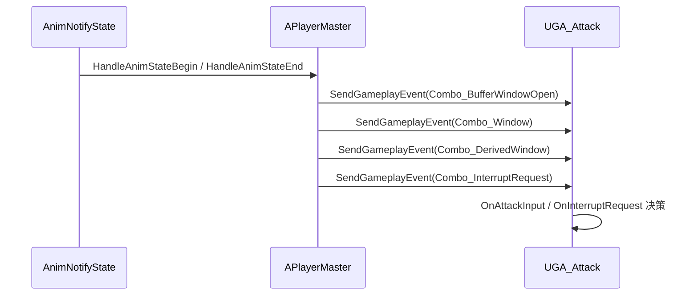
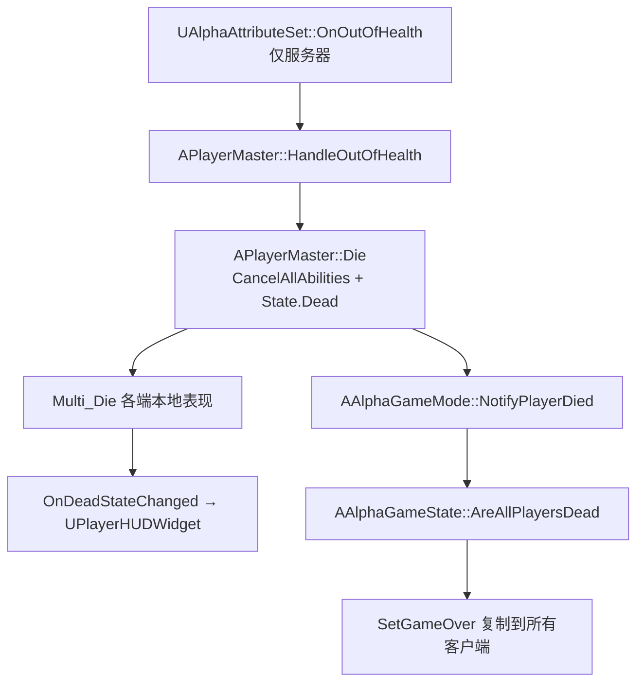

# Alpha 代码亮点

> 这是 [README](../README.md) 的配套深入阅读材料。
> 摘录标准：**能体现设计取舍**的片段，而非全部实现。代码均为源码原样摘录（含作者注释）。
> 行号对应编写时的提交，源码变动后请同步更新。

## 目录

| # | 主题 | 片段数 |
|---|---|---|
| 1 | GAS 连招：三层输入窗口与事件驱动中断 | 4 |
| 2 | 死亡链路与网络复制 | 5 |
| 3 | Motion Matching 驱动移动动画 | 3 |
| 4 | 属性集与 GameplayEffect 结算 | 4 |
| 5 | UI 事件驱动解耦 | 3 |

## 链路总览

### 连招事件链路



窗口事件统一经 `APlayerMaster::SendGameplayEvent()` 出口，标签集中定义在 `Combat/AlphaGameplayTags.h`。

### 死亡链路



---

## 1. GAS 连招：三层输入窗口与事件驱动中断

### 1.1 三层窗口的状态字段

**位置**：`Source/Alpha/Public/Combat/GA_Attack.h:49-59`

```cpp
    // ========== 运行时连招状态 ==========
    int32 ComboStep = 0;                // 当前段号（0-based：基础 0~3，衍生 0~1）
    bool bInDerivedBranch = false;      // 是否已进入衍生分支
    bool bDerivedWindowOpen = false;    // 衍生窗口是否打开（第2段收招 Notify 置位）
    bool bHasBufferedInput = false;     // 是否有缓冲输入
    EAttackHand BufferedHand = EAttackHand::Left;       // 缓冲输入的手
    //bool bBufferedInDerivedWindow = false;              // 缓冲输入按下时窗口是否已开
    FTimerHandle InputListenerTimerHandle;   // 延迟注册输入监听器的定时器句柄（能力提前结束时用于清除，避免残留回调）

    bool bInComboWindow = false;        // 是否在「连招接续窗口」内（可接下一段）
    bool bComboWindowPassed = false;    // 接续窗口是否已结束（进入收招后段）
    bool bBufferWindowOpen = false;   // 缓冲窗口是否打开（接续窗口前的短窗口，收窄缓冲提前量）
```

**设计意图**：用 4 个布尔标志把「一段招式的时间轴」显式建模为可组合的窗口状态，而不是用状态机类或时间戳推算——每个窗口由一个 AnimNotifyState 驱动开/关，判定逻辑退化为读标志位。

### 1.2 单一输入回调内的三层路由

**位置**：`Source/Alpha/Private/Combat/GA_Attack.cpp:184-208`

```cpp
// 收到攻击输入（整个连招期间持续监听）
void UGA_Attack::OnAttackInput(FGameplayEventData Payload)
{

    const bool bLeft = Payload.EventTag.MatchesTagExact(AlphaGameplayTags::Input_Attack_Left);
    const EAttackHand Hand = bLeft ? EAttackHand::Left : EAttackHand::Right;

    if (bInComboWindow)
    {
        // 接续窗口内 → 立即接下一段
        AdvanceCombo(Hand, false);
    }
    else if (!bComboWindowPassed && bBufferWindowOpen)   // 攻击段内、且缓冲窗口已打开 → 才缓冲
    {
        bHasBufferedInput = true;
        BufferedHand = Hand;
    }
    else
    {
        // 接续窗口已过（收招后段）→ 忽略，除非衍生窗口打开
        if (bDerivedWindowOpen)
        {
            AdvanceCombo(Hand, true);
        }
    }
}
```

**设计意图**：一个输入回调里完成三层窗口的全部路由——**接续窗口**立即接段、**缓冲窗口**存入缓冲、**衍生窗口**走带标记的推进分支；三个窗口由时间轴先后顺序互斥，因此 if/else 优先级天然表达了设计意图。

### 1.3 段号推进与衍生分支决策

**位置**：`Source/Alpha/Private/Combat/GA_Attack.cpp:211-248`

```cpp
// 推进到下一段（核心分支决策）
void UGA_Attack::AdvanceCombo(EAttackHand Hand, bool bPressedInDerivedWindow)
{

    // 边界保护：已在最后一段（基础第4段 ComboStep==3 / 衍生第2段 ComboStep==1），
    // 不允许再推进，直接结束连招。否则 ComboStep 会溢出到 4，取到衍生段的 Montage。
    if ((!bInDerivedBranch && ComboStep >= 3) || (bInDerivedBranch && ComboStep >= 1))
    {
        EndCombo();
        return;
    }

    // 此时 ComboStep 仍是「刚播完的段号」，据此决定下一段
    if (!bInDerivedBranch)
    {
        if (ComboStep == 1)
        {
            // 刚播完基础第2段 → 分支决策
            if (bPressedInDerivedWindow)
            {
                // 停顿后按 → 进入衍生分支
                bInDerivedBranch = true;
                ComboStep = 0;             // 衍生第1段
            }
            else
            {
                // 快速连按 → 基础第3段
                ComboStep = 2;
            }
        }
        else
        {
            ComboStep++;                    // 第1→2，或第3→4
        }
    }
    else
    {
        ComboStep++;                        // 衍生1→2
    }
```

**设计意图**：`ComboStep` 复用为「基础段 0~3 / 衍生段 0~1」两个命名空间，靠 `bInDerivedBranch` 区分语义；分支决策点收敛在 `ComboStep == 1` 一处，避免为衍生分支另建一套段号体系。

### 1.4 缓冲优先于中断

**位置**：`Source/Alpha/Private/Combat/GA_Attack.cpp:319-331`

```cpp
// 收到中断请求（移动/跳跃触发）：缓冲攻击优先于中断
void UGA_Attack::OnInterruptRequest(FGameplayEventData Payload)
{
    // 有尚未消费的缓冲攻击（且接续窗口未过）→ 忽略中断，
    // 让缓冲在接续窗口打开时正常接下一段（缓冲优先）
    if (bHasBufferedInput && !bComboWindowPassed)
    {
        return;
    }

    // 无有效缓冲 → 真正中断（EndCombo 内部会停 Montage + EndAbility）
    EndCombo();
}
```

**设计意图**：中断的**决策权归属能力自身**——`APlayerMaster::TryInterruptCombo()`（`PlayerMaster.cpp:392-402`）只负责发 `Combo.InterruptRequest` 事件，是否真正中断由 `GA_Attack` 依据自身缓冲状态裁定，避免角色类反向依赖连招内部状态。

---

## 2. 死亡链路与网络复制

### 2.1 死亡 API 面与多播声明

**位置**：`Source/Alpha/Public/Player/PlayerMaster.h:206-220`

```cpp
	/** 死亡：服务器权威入口。只做判定与广播，不做表现。 */
	void Die();

	/** 死亡表现：每个端各自执行（动画 / 碰撞 / 输入都是本地状态，不参与复制）。 */
	UFUNCTION(NetMulticast, Reliable)
	void Multi_Die();

	/**
	 * 死亡状态变化广播。
	 * 由 Multi_Die / Multi_Revive 在所有端各自触发，HUD 据此显示或隐藏个人死亡面板。
	 * 刻意不用 RepNotify：Multi_Die 里已本地赋值 bDead，属性复制到达时新旧值相同，
	 * OnRep 不会触发，客户端 HUD 就收不到通知。
	 */
	UPROPERTY(BlueprintAssignable, Category = "Death")
	FOnDeadStateChangedSignature OnDeadStateChanged;
```

**设计意图**：注释直接记录了一个**已踩过的网络复制陷阱**——`bDead` 既复制又要在本地广播时，RepNotify 会因「多播已提前赋值导致新旧值相同」而静默失效，故改用显式多播委托。

### 2.2 权威死亡入口 `Die()`

**位置**：`Source/Alpha/Private/Player/PlayerMaster.cpp:436-461`

```cpp
// 死亡：服务器权威入口，只判定 + 广播
void APlayerMaster::Die()
{
	if (!HasAuthority()) return;
	if (bDead) return;   // 幂等：多段伤害可能在同帧内重复触发

	bDead = true;

	// 死亡瞬间清空所有进行中的能力。否则正在播的连招 / 攻击 GA 会继续跑完，
	// 把稍后播放的死亡蒙太奇覆盖掉。
	// 紧接着打上 State.Dead：之后任何激活请求都会被 CanActivateAbility 拦掉。
	if (AbilitySystemComponent)
	{
		AbilitySystemComponent->CancelAllAbilities();
		AbilitySystemComponent->SetLooseGameplayTagCount(AlphaGameplayTags::State_Dead, 1);
	}

	Multi_Die();

	// 通知规则层做团灭判定。放在 Multi_Die 之后：先让自己的表现启动，再上报规则层。
	// GetAuthGameMode 只在服务器有值，客户端返回 null —— 与 Die 的服务器权威语义天然对齐。
	if (AAlphaGameMode* GM = GetWorld() ? GetWorld()->GetAuthGameMode<AAlphaGameMode>() : nullptr)
		GM->NotifyPlayerDied(this);

	// 刻意不调用 SetLifeSpan：与敌人不同，玩家死亡后角色必须保留，
	// 后续结算 / 观战 / 重生都要用到它。
}
```

**设计意图**：`Die()` 严格限定为「权威判定 + 广播」，零表现代码；顺序上先 `Multi_Die()`（本地表现先启动）再上报 `GameMode`（规则层结算），职责边界与调用时序都有注释固化。

### 2.3 `Multi_Die`：各端本地赋值 + 标签授予

**位置**：`Source/Alpha/Private/Player/PlayerMaster.cpp:464-487`

```cpp
// 死亡表现：各端各自执行
void APlayerMaster::Multi_Die_Implementation()
{
	// 客户端也置位：远端与本地同时进入死亡状态
	bDead = true;

	// 通知本地 HUD 显示个人死亡面板（各端各自触发）
	OnDeadStateChanged.Broadcast(true);

	// 每个端各自打标：LooseGameplayTag 不参与复制，必须由多播在本地各自授予。
	// 本地玩家的攻击输入会触发客户端预测激活，本地没有这个标签就会先播攻击动画、
	// 再被服务器拒绝，产生动画回滚抖动。
	if (AbilitySystemComponent)
	{
		AbilitySystemComponent->SetLooseGameplayTagCount(AlphaGameplayTags::State_Dead, 1);
	}

	// 1. 停住当前位移。
	//    刻意不用 DisableMovement()——那会让死亡发生在空中时角色永久悬停。
	//    保留重力与移动组件，靠「输入锁 + 能力取消」阻止继续移动。
	if (UCharacterMovementComponent* Move = GetCharacterMovement())
	{
		Move->StopMovementImmediately();
	}
```

**设计意图**：解释了**为何需要多播而非纯复制**——`LooseGameplayTag` 不参与复制，若不在各端本地授予，`LocalPredicted` 的连招会在客户端先激活再被服务器拒绝，出现动画回滚抖动。

### 2.4 能力基类的死亡拦截

**位置**：`Source/Alpha/Private/Combat/AlphaGameplayAbility.cpp:11-37`

```cpp
// 统一激活检查：基类规则 + 死亡状态拦截
bool UAlphaGameplayAbility::CanActivateAbility(
    const FGameplayAbilitySpecHandle Handle,
    const FGameplayAbilityActorInfo* ActorInfo,
    const FGameplayTagContainer* SourceTags,
    const FGameplayTagContainer* TargetTags,
    FGameplayTagContainer* OptionalRelevantTags) const
{
    // 先走父类：冷却、消耗、ActivationBlockedTags、NetExecutionPolicy 等原生规则
    if (!Super::CanActivateAbility(Handle, ActorInfo, SourceTags, TargetTags, OptionalRelevantTags))
    {
        return false;
    }

    // 死亡状态统一拦截。
    // 写在这里而非各 GA 内部：所有派生能力（GA_Attack / GA_EnemyAttack / GA_HitReact）
    // 自动继承，后续新增能力也不会漏。
    // 查的是 ASC 实际持有的 OwnedTags —— LooseGameplayTag 也在其中。
    if (const UAbilitySystemComponent* ASC =
        ActorInfo ? ActorInfo->AbilitySystemComponent.Get() : nullptr)
    {
        if (ASC->HasMatchingGameplayTag(AlphaGameplayTags::State_Dead))
        {
            return false;
        }
    }

    return true;
}
```

**设计意图**：把死亡拦截上提到能力基类单一覆写点，使所有现有与未来派生能力自动继承，避免每个 GA 里重复判死亡；同时注释指明了「查 `OwnedTags` 而非 `SourceTags`」这一易错点。

### 2.5 团灭判定：遍历事实而非维护计数器

**位置**：`Source/Alpha/Private/AlphaGameState.cpp:47-68`

```cpp
bool AAlphaGameState::AreAllPlayersDead() const
{
	// 没有玩家时不算团灭：开局 PlayerArray 尚未填充，会被误判为团灭
	if (PlayerArray.Num() == 0) return false;

	for (APlayerState* PS : PlayerArray)
	{
		if (!PS) continue;

		APawn* Pawn = PS->GetPawn();
		if (!Pawn) continue;   // 尚未生成 Pawn 或已掉线，不参与判定

		// 只要还有一个活着的玩家就不是团灭
		const APlayerMaster* Player = Cast<APlayerMaster>(Pawn);
		if (Player && !Player->IsDead())
		{
			return false;
		}
	}

	return true;
}
```

**设计意图**：**遍历事实而非维护计数器**——判定结果天然幂等，玩家掉线或中途加入无需额外同步计数；`PlayerArray.Num() == 0` 的早退规避开局误判。

---

## 3. Motion Matching 驱动移动动画

### 3.1 Chooser 表与 Pose Search 数据库句柄

**位置**：`Source/Alpha/Public/Player/PlayerAnimInstance.h:85-95`

```cpp
	// Chooser 表资产，可在蓝图中指定
	UPROPERTY(EditAnywhere, BlueprintReadWrite, Category = "Animation")
	TObjectPtr<UChooserTable> AnimChooserTable;

	// Chooser 评估选中的 PoseSearchDatabase（供 Motion Matching 使用）
	UPROPERTY(BlueprintReadOnly, Category = "Animation")
	TObjectPtr<UPoseSearchDatabase> SelectedPoseSearchDatabase;

	// 站立↔移动过渡状态（供 Chooser 过滤与 AnimGraph 打断 continuing pose 使用）
	UPROPERTY(BlueprintReadOnly, Category = "Animation")
	EMoveTransition MoveTransition;
```

**设计意图**：C++ 侧只持有「Chooser 表」与「选中的 PSD」两个资产句柄，把「哪些状态该用哪个动画库」的决策留在 Chooser 资产内，代码不硬编码选库规则。

### 3.2 Chooser 评估实现

**位置**：`Source/Alpha/Private/Player/PlayerAnimInstance.cpp:263-280`

```cpp
void UPlayerAnimInstance::EvaluateAnimChooser() 
{

	//如果选择表为空，直接清空数据库引用并返回
	if (!AnimChooserTable)
	{
		SelectedPoseSearchDatabase = nullptr;
		return;
	}

	// ContextObject 传 this（AnimInstance 自身）
	UObject* Result = UChooserFunctionLibrary::EvaluateChooser(
		this,
		AnimChooserTable,
		UPoseSearchDatabase::StaticClass()
	);
	SelectedPoseSearchDatabase = Cast<UPoseSearchDatabase>(Result);
}
```

**设计意图**：以 `AnimInstance` 自身作为 Chooser 的 ContextObject，使 Chooser 内部的过滤条件（`MoveState` / `MoveTransition` 等蓝图可读属性）直接取用本类字段，无需额外传参结构体。

### 3.3 本地 / 远端分流的动画数据源

**位置**：`Source/Alpha/Private/Player/PlayerAnimInstance.cpp:117-143`

```cpp
	// 【联机】移动状态来源按「本地 / 远端」分流：
	// - 本地（AutonomousProxy）：用输入层 bIsMoving —— 松键立即 false，无延迟。
	// - 远端（SimulatedProxy）：用服务器权威 SpeedAuth。
	const bool bLocallyControlled = Player->IsLocallyControlled();
	if (bLocallyControlled)
	{
		// 本地：输入层状态，松键立即 false，无延迟
		bIsMoving = Player->GetIsMoving();
	}
	else
	{
		// 远端：速度的「幅值」与「方向」分别取源 ——
		// 幅值用服务器权威 SpeedAuth（两端一致，供状态判定 / Stride Warping）；
		// 方向必须真实：Orientation Warping 的公式是
		//   Orientation = RotationBetween(RootMotionDirection, LocomotionDirection)
		// 若用 ActorForwardVector 伪造方向，减速/转向时与真实移动方向有夹角，
		// 腿部会被按错误角度扭曲（表现为碎步）；且速度归零时该向量退化为零向量。）
		const FVector ReplicatedVelocity = Player->GetVelocity();
		const FVector MoveDir = ReplicatedVelocity.SizeSquared2D() > KINDA_SMALL_NUMBER
			? ReplicatedVelocity.GetSafeNormal2D()
			: Player->GetActorForwardVector();     // 速度极小时方向无意义，回退到朝向

		MovementSpeed = Player->GetSpeedAuth();
		FullVelocity = MoveDir * MovementSpeed;   // 方向真实 + 幅值权威，且 Size2D() == MovementSpeed

		bIsMoving = Player->GetIsMovingAuth();
	}
```

**设计意图**：远端速度采用「**幅值取权威 `SpeedAuth` + 方向取真实复制速度**」的组合——幅值保证两端 Motion Matching 输入一致，方向保证 Orientation Warping 的角度计算正确（注释给出了伪造方向导致「碎步」的因果链）。

---

## 4. 属性集与 GameplayEffect 结算

### 4.1 属性声明与归零委托

**位置**：`Source/Alpha/Public/Combat/AlphaAttributeSet.h:22-46`

```cpp
DECLARE_DYNAMIC_MULTICAST_DELEGATE(FOnOutOfHealthSignature);

UCLASS()
class ALPHA_API UAlphaAttributeSet : public UAttributeSet
{
	GENERATED_BODY()

public:
	UAlphaAttributeSet();

    // 属性复制注册：把各属性登记进网络复制系统
    virtual void GetLifetimeReplicatedProps(TArray<FLifetimeProperty>& OutLifetimeProps) const override;

    // GE 生效后的统一回调：在此处对属性做钳制（0 ~ Max），并处理死亡等派生逻辑,仅在服务器执行。
    virtual void PostGameplayEffectExecute(const struct FGameplayEffectModCallbackData& Data) override;

	/** 生命值归零时广播（仅服务器）。监听方在此启动死亡流程。 */
	UPROPERTY(BlueprintAssignable, Category = "Attributes|Events")
	FOnOutOfHealthSignature OnOutOfHealth;

	// ========== 生命值 ==========
	UPROPERTY(BlueprintReadOnly, ReplicatedUsing = OnRep_Health, Category = "Attributes|Vital")
	FGameplayAttributeData Health;
	ATTRIBUTE_ACCESSORS_BASIC(UAlphaAttributeSet, Health);
```

**设计意图**：用 `ATTRIBUTE_ACCESSORS_BASIC` 宏一次性生成 Getter/Setter/Attribute 访问器，属性只需声明数据字段；`ReplicatedUsing` 与 `OnOutOfHealth` 委托让「值变化」与「语义事件（归零）」成为两条可分别订阅的通道。

### 4.2 归零去重标记 `bOutOfHealth`

**位置**：`Source/Alpha/Private/Combat/AlphaAttributeSet.cpp:20-48`

```cpp
void UAlphaAttributeSet::PostGameplayEffectExecute(const FGameplayEffectModCallbackData& Data)
{
    Super::PostGameplayEffectExecute(Data);

    // 只钳制本次被修改的那个属性，避免无谓钳制
    const FGameplayAttribute ModifiedAttribute = Data.EvaluatedData.Attribute;

    if (ModifiedAttribute == GetHealthAttribute())
    {
        SetHealth(FMath::Clamp(GetHealth(), 0.f, GetMaxHealth()));

        // 生命归零 → 死亡处理
        if (GetHealth() <= 0.f)
        {
            // 只在「首次跨越临界点」时广播：连招多段命中、中毒每周期跳伤
            // 都会反复走到这里，不判 bOutOfHealth 会导致死亡事件被触发多次。
            if (!bOutOfHealth)
            {
                bOutOfHealth = true;
                OnOutOfHealth.Broadcast();
            }
        }
        else
        {
            // 生命回升（治疗 / 后续复活）→ 复位标记，使下次归零能再次广播
            bOutOfHealth = false;
        }
    }
    else if (ModifiedAttribute == GetManaAttribute())
    {
        SetMana(FMath::Clamp(GetMana(), 0.f, GetMaxMana()));
    }
    else if (ModifiedAttribute == GetStaminaAttribute())
    {
        SetStamina(FMath::Clamp(GetStamina(), 0.f, GetMaxStamina()));
    }
    
}
```

**设计意图**：把「**边沿检测**」下沉到属性集——多段伤害 / 周期扣血会反复进入 `PostGameplayEffectExecute`，用 `bOutOfHealth` 保证死亡事件只广播一次，且血量回升时自动复位，使**治疗与复活复用同一机制**（`Revive()` 因此无需额外重置）。

### 4.3 属性复制注册与 `REPNOTIFY_Always` 的取舍

**位置**：`Source/Alpha/Private/Combat/AlphaAttributeSet.cpp:60-71`

```cpp
void UAlphaAttributeSet::GetLifetimeReplicatedProps(TArray<FLifetimeProperty>& OutLifetimeProps) const
{
    Super::GetLifetimeReplicatedProps(OutLifetimeProps);

    // COND_None            → 复制给所有客户端（血条 / HUD 需要，不能用 OwnerOnly）
    // REPNOTIFY_Always     → 值即使相同也触发 OnRep，避免「钳制回原值」时 UI 不同步
    DOREPLIFETIME_CONDITION_NOTIFY(UAlphaAttributeSet, Health, COND_None, REPNOTIFY_Always);
    DOREPLIFETIME_CONDITION_NOTIFY(UAlphaAttributeSet, MaxHealth, COND_None, REPNOTIFY_Always);
    DOREPLIFETIME_CONDITION_NOTIFY(UAlphaAttributeSet, Mana, COND_None, REPNOTIFY_Always);
    DOREPLIFETIME_CONDITION_NOTIFY(UAlphaAttributeSet, MaxMana, COND_None, REPNOTIFY_Always);
    DOREPLIFETIME_CONDITION_NOTIFY(UAlphaAttributeSet, Stamina, COND_None, REPNOTIFY_Always);
    DOREPLIFETIME_CONDITION_NOTIFY(UAlphaAttributeSet, MaxStamina, COND_None, REPNOTIFY_Always);
}
```

**设计意图**：`REPNOTIFY_Always` 的选用有明确工程理由——属性被钳制回原值时「值未变但 UI 需同步」，若用默认的 `REPNOTIFY_OnChanged` 会漏更新，是一处易被忽略的网络细节。

### 4.4 伤害结算的权威根防线

**位置**：`Source/Alpha/Private/Combat/AlphaAttributeComponent.cpp:66-95`

```cpp
// 对目标应用 GE（目标需实现 IAbilitySystemInterface 且有自己的 ASC）
FActiveGameplayEffectHandle UAlphaAttributeComponent::ApplyEffectToTarget(
    AActor* Target, TSubclassOf<UGameplayEffect> EffectClass,
    FGameplayTag SetByCallerTag, float SetByCallerValue)
{
    if (!CachedASC || !EffectClass || !Target) return FActiveGameplayEffectHandle();

    // 根防线 2：伤害结算只能在服务器进行。
    if (!GetOwner() || !GetOwner()->HasAuthority()) return FActiveGameplayEffectHandle();

    // 目标必须实现 GAS 接口，且有自己的 ASC
    IAbilitySystemInterface* TargetInterface = Cast<IAbilitySystemInterface>(Target);
    if (!TargetInterface) return FActiveGameplayEffectHandle();
    UAbilitySystemComponent* TargetASC = TargetInterface->GetAbilitySystemComponent();
    if (!TargetASC) return FActiveGameplayEffectHandle();

    // 用玩家自己的 ASC 构造 Spec，GE 资产引用来自攻击方（玩家），敌人无需配 GE
    FGameplayEffectContextHandle Context = CachedASC->MakeEffectContext();
    Context.AddSourceObject(GetOwner());
    Context.AddInstigator(GetOwner(), GetOwner());

    FGameplayEffectSpecHandle Spec = CachedASC->MakeOutgoingSpec(EffectClass, 1.f, Context);
    if (!Spec.IsValid()) return FActiveGameplayEffectHandle();

    if (SetByCallerTag.IsValid())
    {
        Spec.Data->SetSetByCallerMagnitude(SetByCallerTag, SetByCallerValue);
    }

    return CachedASC->ApplyGameplayEffectSpecToTarget(*Spec.Data.Get(), TargetASC);
}
```

**设计意图**：`HasAuthority()` 作为「根防线」内嵌在组件层，使所有调用方（武器命中、AI 攻击、蓝图）无需各自判权威；`Cast<IAbilitySystemInterface>` 而非 `Cast<APlayerMaster>` 让玩家 / 敌人共用同一入口。

---

## 5. UI 事件驱动解耦

### 5.1 敌人血条：订阅属性变化委托

**位置**：`Source/Alpha/Private/UI/EnemyHealthBarWidget.cpp:8-37`

```cpp
void UEnemyHealthBarWidget::InitializeHealthBar(UAbilitySystemComponent* InASC)
{
	if (!InASC || bInitialized) return;

	const UAlphaAttributeSet* AttrSet = InASC->GetSet<UAlphaAttributeSet>();
	if (!AttrSet) return;   // ASC 未 InitAbilityActorInfo 时返回 null

	CachedASC = InASC;
	bInitialized = true;

	// 事件驱动：血量一变就刷新血条
	InASC->GetGameplayAttributeValueChangeDelegate(AttrSet->GetHealthAttribute())
		.AddUObject(this, &UEnemyHealthBarWidget::OnHealthChanged);

	RefreshBar();
}

void UEnemyHealthBarWidget::OnHealthChanged(const FOnAttributeChangeData& Data)
{
	if (!HealthBar) return;
	const UAlphaAttributeSet* AttrSet =
		CachedASC.IsValid() ? CachedASC->GetSet<UAlphaAttributeSet>() : nullptr;
	if (!AttrSet) return;

	const float Max = AttrSet->GetMaxHealth();
	HealthBar->SetPercent(Max > 0.f ? (Data.NewValue / Max) : 0.f);

	// 满血隐藏，受伤才显示
	SetVisibility(Data.NewValue >= Max ? ESlateVisibility::Hidden : ESlateVisibility::Visible);
}
```

**设计意图**：订阅 GAS 原生的 `GetGameplayAttributeValueChangeDelegate`，**零 Tick 轮询**；`bInitialized` 保证幂等绑定、`TWeakObjectPtr` 缓存 ASC 防悬空，并有 `RefreshBar()` 补一次初始状态（委托收不到「绑定前」的变化）。

### 5.2 玩家 HUD：属性 + 死亡状态双路订阅

**位置**：`Source/Alpha/Private/UI/PlayerHUDWidget.cpp:10-45`

```cpp
void UPlayerHUDWidget::InitializeHUD(APlayerMaster* InPlayer)
{
    if (!InPlayer || bInitialized) return;

    UAbilitySystemComponent* ASC = InPlayer->GetAbilitySystemComponent();
    if (!ASC) return;

    const UAlphaAttributeSet* AttrSet = ASC->GetSet<UAlphaAttributeSet>();
    if (!AttrSet) return;   // 若这里返回 null，说明 ASC 没 InitAbilityActorInfo

    OwningPlayer = InPlayer;
    CachedASC = ASC;
    bInitialized = true;

    // 事件驱动：属性一变，回调里刷新对应条（符合项目约定）
    ASC->GetGameplayAttributeValueChangeDelegate(AttrSet->GetHealthAttribute())
        .AddUObject(this, &UPlayerHUDWidget::OnHealthChanged);
    ASC->GetGameplayAttributeValueChangeDelegate(AttrSet->GetManaAttribute())
        .AddUObject(this, &UPlayerHUDWidget::OnManaChanged);
    ASC->GetGameplayAttributeValueChangeDelegate(AttrSet->GetStaminaAttribute())
        .AddUObject(this, &UPlayerHUDWidget::OnStaminaChanged);

    RefreshAllBars();

    // 订阅自己的死亡状态。面板显隐改由「自己是否死亡」驱动，
    // 而不是全局的 GameState::bGameOver —— 这样各自独立复活、互不影响。
    // OwningPlayer 是 HUD 持有者本人，所以只会收到自己的状态变化。
    OwningPlayer->OnDeadStateChanged.AddDynamic(this, &UPlayerHUDWidget::HandleDeadStateChanged);

    // 只在真的死了时才补一次：HUD 创建可能晚于死亡（例如中途加入的玩家），
    // 而委托只能收到「之后」的变化，收不到已经发生的那次。
    // 活着时刻意不调用 —— HandleDeadStateChanged(false) 会触发 OnReviveUI，
    // 将来那里若加了复活特效/音效，游戏开局会误触发一次。
    if(OwningPlayer->IsDead())
        HandleDeadStateChanged(true);
}
```

**设计意图**：**个人状态驱动个人 UI**——面板显隐订阅 `APlayerMaster::OnDeadStateChanged`（自己）而非 `AAlphaGameState::OnGameOverChanged`（全局），实现「各自独立复活」；并刻意区分「死亡时补发一次」与「活着时不补发」，避免未来给 `OnReviveUI` 加特效时开局误触发。

### 5.3 死亡状态 → 输入模式切换

**位置**：`Source/Alpha/Private/UI/PlayerHUDWidget.cpp:94-113`

```cpp
void UPlayerHUDWidget::HandleDeadStateChanged(bool bIsDead)
{
    // HUD 本就只在本地控制器的 Pawn 上创建（见 APlayerMaster::TryCreateHUD），
    // 这里再判一次属防御性写法：多播会覆盖所有端，远端 Pawn 的广播不该影响本地界面。
    if (!OwningPlayer.IsValid() || !OwningPlayer->IsLocallyControlled()) return;

    APlayerController* PC = Cast<APlayerController>(OwningPlayer->GetController());
    if (!PC) return;

    if (bIsDead)
    {
        PC->SetShowMouseCursor(true);
        PC->SetInputMode(FInputModeUIOnly());
        OnGameOverUI();      // 显示个人死亡面板
    }
    else
    {
        PC->SetShowMouseCursor(false);
        PC->SetInputMode(FInputModeGameOnly());
        OnReviveUI();        // 隐藏面板
    }
}
```

**设计意图**：把「视觉表现」留在蓝图（`BlueprintImplementableEvent`），C++ 只负责**状态 → 输入模式**的确定映射；`IsLocallyControlled()` 二次防御是因为多播会覆盖所有端，远端 Pawn 的广播不该干扰本地界面。

---

## 附：三层权威防线（非冗余，属纵深防御）

| 层 | 位置 | 检查内容 |
|---|---|---|
| 能力基类 | `UAlphaGameplayAbility::CanActivateAbility` | 死亡标签拦截 |
| 属性组件 | `UAlphaAttributeComponent::ApplyEffectToSelf/ToTarget` | `HasAuthority` |
| 角色类 | `APlayerMaster::Die` / `Revive` | `HasAuthority` + 状态幂等 |

三层各有一道检查，是**纵深防御**而非重复代码——调用方即使漏判，下层仍会兜住。

## 附：一处易踩的时序约束

`APlayerMaster::Revive()` 必须调用 `AAlphaGameState::ClearGameOver()`，否则 `NotifyPlayerDied` 的早退逻辑会让后续团灭判定永久失效（该约束在 `AlphaGameState.h` 的 `ClearGameOver` 文档注释中亦有记录）。
